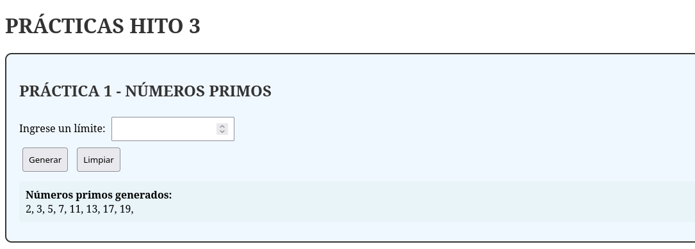
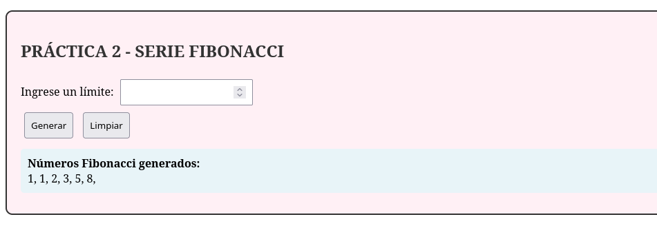

# 🚀 Prácticas HITO 3 - Documentación Técnica

## 📁 Estructura del Proyecto
```
proyecto-hito3/
├── docker-compose.yml          # Configuración Docker
├── src/
│   ├── index.php              # Interfaz principal
│   ├── procedimientos.php     # Lógica números primos
│   └── funciones.php          # Lógica serie Fibonacci
```

---

## 🔢 PRÁCTICA 1: Generador de Números Primos

### 📊 Diagrama de Flujo - Números Primos
```
┌─────────────────┐    ┌─────────────────────┐    ┌────────────────────┐
│   Formulario    │    │  generaPrimos($n)   │    │   Algoritmo Primo  │
│   HTML POST     │───▶│   Función Principal │───▶│   Verificación     │
└─────────────────┘    └─────────────────────┘    └────────────────────┘
                              │                            │
                              ▼                            ▼
                      ┌─────────────────┐    ┌────────────────────┐
                      │  Inicialización │    │  Bucle división    │
                      │  $primos = []   │    │  2 → sqrt($numero) │
                      │  $numero = 2    │    └────────────────────┘
                      └─────────────────┘              │
                              │                        │
                              ▼                        ▼
                      ┌─────────────────┐    ┌────────────────────┐
                      │  While count()  │    │  Si es primo →     │
                      │   < $limite     │    │  agregar a array   │
                      └─────────────────┘    └────────────────────┘
                              │
                              ▼
                      ┌─────────────────┐
                      │  Imprimir con   │
                      │  implode()      │
                      └─────────────────┘
```

### 🔍 Explicación del Código - Primos

**procedimientos.php**
```php
function generaPrimos($limite) {
    // ✅ Validación entrada
    if ($limite <= 0) {
        echo "El límite debe ser mayor a 0";
        return;
    }
    
    $primos = [];      // 📦 Array para almacenar resultados
    $numero = 2;       // 🔢 Comenzar desde el primer primo
    
    // 🔁 Continuar hasta tener 'n' primos
    while (count($primos) < $limite) {
        $esPrimo = true;  // 🏁 Asumir que es primo inicialmente
        
        // 🔍 Verificar divisibilidad
        for ($i = 2; $i <= sqrt($numero); $i++) {
            if ($numero % $i == 0) {
                $esPrimo = false;  // ❌ No es primo
                break;             // 🚫 Salir del bucle temprano
            }
        }
        
        // ✅ Agregar a la lista si es primo
        if ($esPrimo) {
            $primos[] = $numero;
        }
        $numero++;  // ➕ Siguiente número a verificar
    }
    
    // 🖨️ Formatear y mostrar resultados
    echo implode(', ', $primos) . ',';
}
```

### 🧮 Ejemplo de Ejecución - Primos
```
Entrada: generaPrimos(5)
Proceso:
  Número 2 → Primo ✅ → [2]
  Número 3 → Primo ✅ → [2, 3]
  Número 4 → No primo ❌ (divisible por 2)
  Número 5 → Primo ✅ → [2, 3, 5]
  Número 6 → No primo ❌
  Número 7 → Primo ✅ → [2, 3, 5, 7]
  Número 8 → No primo ❌
  Número 9 → No primo ❌
  Número 10 → No primo ❌
  Número 11 → Primo ✅ → [2, 3, 5, 7, 11]
Salida: "2, 3, 5, 7, 11,"
```

---

## 🔄 PRÁCTICA 2: Generador de Serie Fibonacci

### 📊 Diagrama de Flujo - Fibonacci
```
┌─────────────────┐    ┌──────────────────────┐    ┌──────────────────┐
│   Formulario    │    │ generaFibonacci($n)  │    │  Inicialización  │
│   HTML POST     │───▶│   Función Principal  │───▶│   $fibonacci[]   │
└─────────────────┘    └──────────────────────┘    └──────────────────┘
                              │                              │
                              ▼                              ▼
                      ┌─────────────────┐    ┌──────────────────┐
                      │   Validación    │    │  Casos base:     │
                      │    $n > 0       │    │  n=1 → [1]       │
                      └─────────────────┘    │  n=2 → [1, 1]    │
                              │              └──────────────────┘
                              ▼                        │
                      ┌─────────────────┐              │
                      │  Bucle for      │◀─────────────┘
                      │  $i=2; $i<$n    │
                      └─────────────────┘
                              │
                              ▼
                      ┌─────────────────┐
                      │  Cálculo:       │
                      │  fib[i] =       │
                      │  fib[i-1] +     │
                      │  fib[i-2]       │
                      └─────────────────┘
                              │
                              ▼
                      ┌─────────────────┐
                      │  Imprimir con   │
                      │  implode()      │
                      └─────────────────┘
```

### 🔍 Explicación del Código - Fibonacci

**funciones.php**
```php
function generaFibonacci($limite) {
    // ✅ Validación entrada
    if ($limite <= 0) {
        echo "El límite debe ser mayor a 0";
        return;
    }
    
    $fibonacci = [];  // 📦 Array para la serie
    
    // 🎯 Casos base de la serie Fibonacci
    if ($limite >= 1) {
        $fibonacci[] = 1;  // 🥇 Primer elemento
    }
    if ($limite >= 2) {
        $fibonacci[] = 1;  // 🥈 Segundo elemento
    }
    
    // 🔢 Generar elementos restantes
    for ($i = 2; $i < $limite; $i++) {
        // 🧮 Cada número es la suma de los dos anteriores
        $fibonacci[] = $fibonacci[$i - 1] + $fibonacci[$i - 2];
    }
    
    // 🖨️ Formatear y mostrar resultados
    echo implode(', ', $fibonacci) . ',';
}
```

### 🧮 Ejemplo de Ejecución - Fibonacci
```
Entrada: generaFibonacci(6)
Proceso:
  Paso 1: $limite >= 1 → [1]
  Paso 2: $limite >= 2 → [1, 1]
  Paso 3: $i=2 → fib[2] = fib[1] + fib[0] = 1 + 1 = 2 → [1, 1, 2]
  Paso 4: $i=3 → fib[3] = fib[2] + fib[1] = 2 + 1 = 3 → [1, 1, 2, 3]
  Paso 5: $i=4 → fib[4] = fib[3] + fib[2] = 3 + 2 = 5 → [1, 1, 2, 3, 5]
  Paso 6: $i=5 → fib[5] = fib[4] + fib[3] = 5 + 3 = 8 → [1, 1, 2, 3, 5, 8]
Salida: "1, 1, 2, 3, 5, 8,"
```

---

## 🌐 INTERFAZ PRINCIPAL (index.php)

### 📊 Diagrama de Interacción
```
┌─────────────────────────────────────────────────────────┐
│                    index.php                             │
├─────────────────────────────────────────────────────────┤
│  ┌─────────────────┐         ┌─────────────────┐        │
│  │  SECCIÓN PRIMOS │         │ SECCIÓN FIBONACCI│        │
│  │                 │         │                 │        │
│  │  [Formulario 1] │────────▶│  [Formulario 2] │        │
│  │  POST limite1   │         │  POST limite2   │        │
│  │                 │         │                 │        │
│  │  ◀─Incluye─     │         │  ◀─Incluye─     │        │
│  │  procedimientos │         │  funciones      │        │
│  └─────────────────┘         └─────────────────┘        │
└─────────────────────────────────────────────────────────┘
         │                              │
         ▼                              ▼
┌─────────────────┐         ┌─────────────────┐
│ generaPrimos()  │         │ generaFibonacci()│
└─────────────────┘         └─────────────────┘
```

### 🔧 Características de la Interfaz

```php
// 🎯 Detección de formulario enviado
if (isset($_POST['generar1']) && isset($_POST['limite1'])) {
    include 'procedimientos.php';        // 📥 Incluir lógica primos
    echo '<div class="resultado">';      // 🎨 Contenedor resultado
    echo '<strong>Números primos generados:</strong><br>';
    generaPrimos((int)$_POST['limite1']); // 🔢 Ejecutar función
    echo '</div>';
}
```

---

## 🐳 CONFIGURACIÓN DOCKER

### 📋 docker-compose.yml
```yaml
version: '3.8'
services:
  web:
    image: php:8.2-apache    # 🐘 PHP con servidor web
    container_name: practicas-hito3
    ports:
      - "8080:80"           # 🌐 Puerto host:contenedor
    volumes:
      - ./src:/var/www/html  # 📁 Sincronización archivos
    working_dir: /var/www/html
    environment:
      - APACHE_DOCUMENT_ROOT=/var/www/html
    restart: unless-stopped  # 🔄 Reinicio automático
```

### 🔄 Flujo Docker
```
┌─────────────────┐    ┌─────────────────┐    ┌─────────────────┐
│   Archivos      │    │   Contenedor    │    │    Navegador    │
│   Locales       │    │   Docker        │    │                 │
│   (src/)        │───▶│   PHP-Apache    │◄───│  localhost:8080 │
└─────────────────┘    └─────────────────┘    └─────────────────┘
```

---

## 🎯 RESUMEN DE FUNCIONALIDADES

| Práctica | Entrada | Proceso | Salida | Complejidad |
|----------|---------|---------|--------|-------------|
| **Primos** | Número límite | Verificación divisibilidad | Lista de primos | O(n√n) |
| **Fibonacci** | Número límite | Suma recursiva | Serie Fibonacci | O(n) |

Ambas prácticas demuestran conceptos fundamentales de programación:
- ✅ Manipulación de arrays
- ✅ Estructuras de control (bucles, condicionales)
- ✅ Funciones y modularización
- ✅ Validación de entrada
- ✅ Integración frontend-backend
