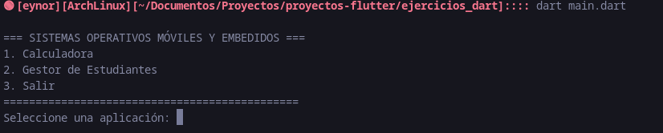

# Ejercicios Dart

Repositorio con dos pequeñas aplicaciones de consola en Dart:
- Calculadora (calculadora.dart)
- Gestor de Estudiantes (gestor_estudiantes.dart)

Ambas aplicaciones son accesibles desde el punto de entrada `main.dart`, que muestra un menú para seleccionar cada aplicación.

Cómo ejecutar
-------------
1. Abrir una terminal en la carpeta:
   /home/eynor/Documentos/Proyectos/proyectos-flutter/ejercicios_dart
2. Ejecutar:
   dart run main.dart
3. Seguir las opciones del menú (ingresar números o texto según la aplicación).

Descripción breve de los ejercicios
-----------------------------------
- Calculadora (calculadora.dart)
  - Operaciones: sumar, restar, multiplicar, dividir.
  - Interfaz por consola: solicita opción y dos números, muestra resultado.
  - Manejo básico de errores (división por cero, entradas inválidas).

- Gestor de Estudiantes (gestor_estudiantes.dart)
  - Estructura Estudiante: nombre y lista de notas.
  - Funciones: agregar estudiante (y sus notas), buscar por nombre, listar todos, mostrar promedio general.
  - Interfaz por consola con menú interno.

Diagrama: conexión de archivos al main
--------------------------------------
El siguiente diagrama muestra qué archivos forman parte del proyecto y su relación con el punto de entrada:

      /---------------------------------\
      |  calculadora.dart               |
      |  (función: calculadora())       |
      \---------------------------------/ 
                   \
                    \
                     \
                      \         /-------------------\
                       \------>|    main.dart       |
                      /       |  (función main)     |
                   /          \---------------------/
      /---------------------------------\ 
      |  gestor_estudiantes.dart        |
      |  (función: gestorEstudiantes()) |
      \---------------------------------/

Diagrama: cómo main importa y llama a las funciones
---------------------------------------------------
Esquema del flujo dentro de main.dart (importaciones y llamadas):

  main.dart
  ├─ import 'calculadora.dart'
  │    └─ expone void calculadora()
  ├─ import 'gestor_estudiantes.dart'
  │    └─ expone void gestorEstudiantes()
  └─ función main():
       ├─ muestra menú principal
       ├─ si opción == '1' => calculadora()        <-- llamada directa
       └─ si opción == '2' => gestorEstudiantes()  <-- llamada directa

Ejemplo de uso rápido
---------------------
- Al iniciar `dart run main.dart` verá:
  1. Seleccionar "1" para entrar a la Calculadora.
  2. Seleccionar "2" para entrar al Gestor de Estudiantes.
  3. Seleccionar "3" para salir.

Notas
-----
- Los archivos fuente relevantes:
  - main.dart
  - calculadora.dart
  - gestor_estudiantes.dart
- El README contiene sólo instrucciones y diagramas; el comportamiento real está en los archivos .dart.
